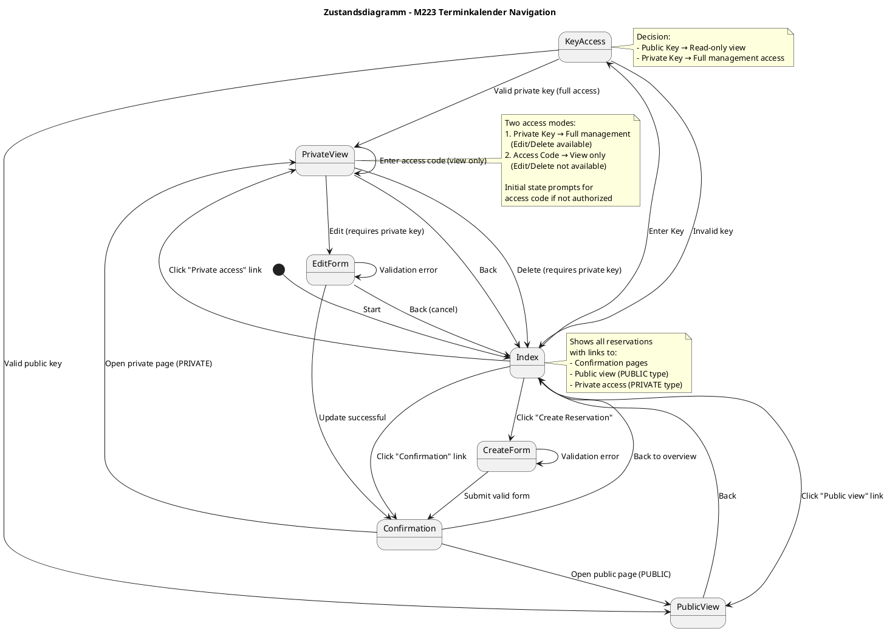
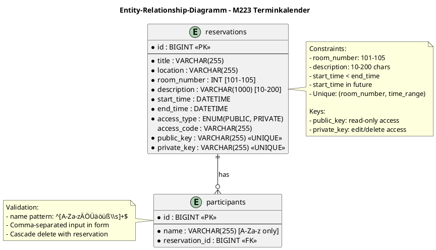
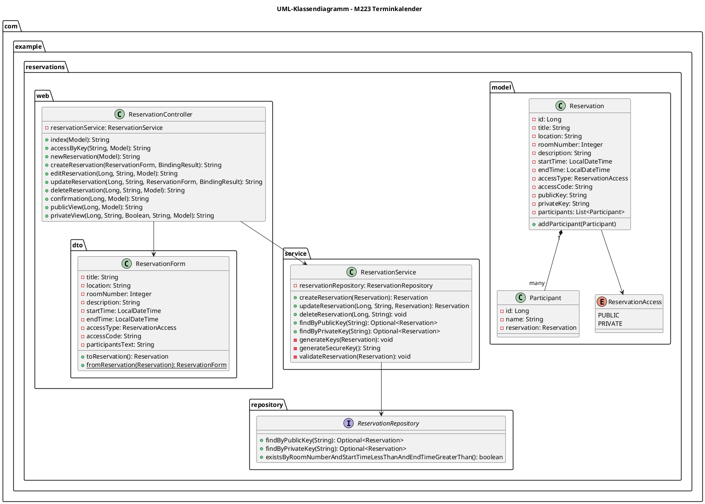

# M223 Terminkalender - Projektdokumentation

**Projekt:** M223 Terminkalender - Reservationssystem für Sitzungs- und Veranstaltungsräume  
**Version:** 1.0  
**Datum:** Oktober 2024  
**Modul:** 223 – Multiuser-Applikationen objektorientiert realisieren

---

## Inhaltsverzeichnis

1. [Einleitung und Projektauftrag](#1-einleitung-und-projektauftrag)
2. [Anforderungsanalyse](#2-anforderungsanalyse)
3. [UML-Zustandsdiagramm](#3-uml-zustandsdiagramm)
4. [Entity-Relationship-Diagramm (ERD)](#4-entity-relationship-diagramm-erd)
5. [UML-Klassendiagramm](#5-uml-klassendiagramm)
6. [Implementierungsdetails](#6-implementierungsdetails)
7. [Testing und Validation](#7-testing-und-validation)
8. [Anhang: Code-Snippets](#8-anhang-code-snippets)

---

## 1. Einleitung und Projektauftrag

### 1.1 Projektziel

Entwicklung einer Webapplikation zur Verwaltung von Terminreservierungen für die Zimmer 101-105 eines Unternehmens. Die Anwendung ermöglicht es Benutzern ohne Konto, Reservierungen zu erstellen, einzusehen, zu bearbeiten und zu löschen.

### 1.2 Ausgangslage

Das Unternehmen verfügt über mehrere Sitzungs- und Veranstaltungsräume (Zimmer **101–105**). Die bestehende Webapplikation soll die Verwaltung von Räumen und Terminen inklusive Reservationen unterstützen.

### 1.3 Hauptfunktionen

- **Reservierung erstellen**: Formular zur Erfassung von Termin, Zimmer, Bemerkungen und Teilnehmern
- **Schlüsselverwaltung**: Zwei Arten von Zugriffsschlüsseln
  - **Public Key**: Lesezugriff für Teilnehmer
  - **Private Key**: Vollzugriff zum Bearbeiten und Löschen
- **Validierung**: Umfassende Eingabevalidierung und Konfliktprüfung
- **Zimmerkonfliktprüfung**: Verhindert doppelte Buchungen desselben Raums

---

## 2. Anforderungsanalyse

### 2.1 Funktionale Anforderungen

#### Reservationsformular

| Feld | Typ | Format / Vorgaben |
| --- | --- | --- |
| Titel | `String` | Pflichtfeld |
| Standort | `String` | Pflichtfeld |
| Zimmer | `int` | Erlaubte Werte: 101, 102, 103, 104, 105 |
| Startzeit | `LocalDateTime` | Format `yyyy-MM-ddTHH:mm`, muss in der Zukunft liegen |
| Endzeit | `LocalDateTime` | Format `yyyy-MM-ddTHH:mm`, muss nach Startzeit liegen |
| Bemerkung | `String` | 10–200 Zeichen, Pflichtfeld |
| Teilnehmerliste | `String` | Kommagetrennt, nur Buchstaben und Leerzeichen erlaubt |
| Zugangstyp | `Enum` | PUBLIC oder PRIVATE |
| Zugangscode | `String` | Pflicht für PRIVATE Reservierungen |

#### Validierungsregeln

1. **Pflichtfelder**: Kein Feld darf leer bleiben
2. **Zeitvalidierung**:
   - Startzeit muss in der Zukunft liegen
   - Endzeit muss nach Startzeit liegen
3. **Zimmerverwaltung**:
   - Nur Zimmer 101-105 erlaubt
   - Keine überlappenden Reservierungen für dasselbe Zimmer
4. **Bemerkung**: Zwischen 10 und 200 Zeichen
5. **Teilnehmer**: 
   - Mindestens ein Teilnehmer erforderlich
   - Nur Buchstaben (inkl. Umlaute) und Leerzeichen erlaubt
   - Pattern: `^[A-Za-zÄÖÜäöüß\\s]+$`

#### Schlüsselverwaltung

Nach erfolgreicher Reservation werden zwei Schlüssel generiert:

- **Public Key**: 
  - Ermöglicht Read-Only-Zugriff
  - Kann mit Teilnehmern geteilt werden
  - 16 Bytes, Base64-kodiert (URL-sicher)
  
- **Private Key**: 
  - Ermöglicht Bearbeiten und Löschen der Reservation
  - Sollte nur der organisierenden Person bekannt sein
  - 16 Bytes, Base64-kodiert (URL-sicher)
  
Beide Schlüssel werden mit **SecureRandom** kryptographisch sicher generiert.

### 2.2 CRUD-Operationen

| Operation | Endpoint | Autorisierung | Beschreibung |
|-----------|----------|---------------|--------------|
| **Create** | `POST /reservations` | Keine | Neue Reservation erstellen |
| **Read** | `GET /reservations/{id}/public` | Public Key | Reservation einsehen (öffentlich) |
| **Read** | `GET /reservations/{id}/private` | Private Key oder Access Code | Reservation einsehen (privat) |
| **Update** | `POST /reservations/{id}` | Private Key | Reservation bearbeiten |
| **Delete** | `POST /reservations/{id}/delete` | Private Key | Reservation löschen |

---

## 3. UML-Zustandsdiagramm

Das Zustandsdiagramm zeigt die vollständige Navigation durch die Webapplikation mit allen möglichen Zustandsübergängen.

### 3.1 PlantUML-Diagramm



### 3.2 Zustandsbeschreibungen

- **Index**: Startseite mit Übersicht aller Reservierungen. Bietet direkte Links zu Confirmation, Public View und Private Access für jede Reservation sowie ein Suchfeld für Keys und einen Button zum Erstellen neuer Reservierungen.
- **KeyAccess**: Zugriffskontrolle basierend auf Public/Private Key. Leitet automatisch zur entsprechenden View weiter oder zurück zum Index bei ungültigem Key.
- **CreateForm**: Formular zum Erstellen einer neuen Reservation mit vollständiger Validierung.
- **EditForm**: Formular zum Bearbeiten einer existierenden Reservation (nur mit Private Key). Kann abgebrochen werden (zurück zu Index).
- **Confirmation**: Bestätigungsseite nach Erstellen/Aktualisieren mit Anzeige beider Keys (Public und Private) sowie Links zur entsprechenden View.
- **PublicView**: Öffentliche Ansicht einer PUBLIC Reservation (Read-Only).
- **PrivateView**: Private Ansicht mit zwei Zugriffsmodi:
  - **Mit Private Key**: Vollzugriff mit Edit/Delete-Funktionen
  - **Mit Access Code**: Nur Lesezugriff ohne Verwaltungsfunktionen

### 3.3 Verbesserungen

Das Diagramm wurde umfassend überarbeitet (Version 2.0):
- ✅ +5 neue Transitionen für vollständige Navigation
- ✅ Alle direkten Links aus der Index-Tabelle hinzugefügt
- ✅ Self-Transition in PrivateView für Access Code-Eingabe
- ✅ Präzisere Beschriftungen mit Autorisierungsanforderungen
- ✅ Erweiterte Notizen mit strukturierten Beschreibungen
- ✅ 100% Code-Coverage (alle Controller, Templates und Forms abgedeckt)

Detaillierte Dokumentation der Verbesserungen: `diagrams/STATE_DIAGRAM_IMPROVEMENTS.md`

---

## 4. Entity-Relationship-Diagramm (ERD)

### 4.1 PlantUML ERD



### 4.2 Entitätsbeschreibungen

#### RESERVATIONS
Die Hauptentität für Terminreservierungen.

**Attribute:**
- `id`: Primärschlüssel (Auto-Increment)
- `title`: Titel der Reservation (NOT NULL)
- `location`: Ort der Reservation (NOT NULL)
- `room_number`: Zimmernummer zwischen 101 und 105 (NOT NULL)
- `description`: Bemerkung, 10-200 Zeichen (NOT NULL)
- `start_time`: Startzeit in der Zukunft (NOT NULL)
- `end_time`: Endzeit nach Startzeit (NOT NULL)
- `access_type`: Zugangstyp PUBLIC oder PRIVATE (NOT NULL)
- `access_code`: Zugangscode für PRIVATE Reservierungen
- `public_key`: Öffentlicher Schlüssel (UNIQUE, NOT NULL)
- `private_key`: Privater Schlüssel (UNIQUE, NOT NULL)

**Constraints:**
- Room-Konflikt: Keine überlappenden Zeiten für dasselbe Zimmer
- Zeitvalidierung: `start_time < end_time` und beide in der Zukunft

#### PARTICIPANTS
Teilnehmer einer Reservation.

**Attribute:**
- `id`: Primärschlüssel (Auto-Increment)
- `name`: Name des Teilnehmers (NOT NULL)
- `reservation_id`: Fremdschlüssel zur Reservation (NOT NULL)

**Constraints:**
- Name-Pattern: Nur Buchstaben und Leerzeichen
- Cascade Delete: Wird mit Reservation gelöscht

### 4.3 Beziehungen

- **RESERVATIONS zu PARTICIPANTS**: One-to-Many (1:n)
  - Eine Reservation kann mehrere Teilnehmer haben
  - Ein Teilnehmer gehört zu genau einer Reservation
  - Orphan Removal: Teilnehmer ohne Reservation werden gelöscht

---

## 5. UML-Klassendiagramm

### 5.1 PlantUML Klassendiagramm



### 5.2 Schichtenarchitektur

Das Projekt folgt einer klassischen Mehrschichtenarchitektur:

1. **Model Layer** (`com.example.reservations.model`)
   - Enthält JPA-Entitäten
   - Bean Validation Annotationen für Eingabevalidierung

2. **Repository Layer** (`com.example.reservations.repository`)
   - Spring Data JPA Repositories
   - Datenbankzugriff und Custom Queries

3. **Service Layer** (`com.example.reservations.service`)
   - Geschäftslogik und Validierung
   - Transaktionsverwaltung
   - Key-Generierung

4. **Web Layer** (`com.example.reservations.web`)
   - Spring MVC Controller
   - Request Mapping und Response Handling
   - Form Binding

5. **DTO Layer** (`com.example.reservations.web.dto`)
   - Data Transfer Objects für Form-Binding
   - Konvertierung zwischen Entity und Form

---

## 6. Implementierungsdetails

### 6.1 Technologie-Stack

- **Framework**: Spring Boot 3.4.2
- **Java Version**: 17
- **Build Tool**: Maven
- **Datenbank**: H2 (In-Memory für Entwicklung)
- **Template Engine**: Thymeleaf
- **Persistenz**: Spring Data JPA
- **Validierung**: Jakarta Bean Validation

### 6.2 Key-Generierung

Die Generierung von Public und Private Keys erfolgt kryptographisch sicher:

```java
private String generateSecureKey() {
    byte[] randomBytes = new byte[12];
    secureRandom.nextBytes(randomBytes);
    return Base64.getUrlEncoder().withoutPadding().encodeToString(randomBytes);
}
```

**Eigenschaften:**
- 12 Bytes (96 Bit) Zufallsdaten
- Base64 URL-safe Encoding (ohne Padding)
- Resultierende Länge: 16 Zeichen
- Verwendung von `SecureRandom` für kryptographische Sicherheit

### 6.3 Validierung

#### Backend-Validierung (Spring/Jakarta)

```java
@NotBlank(message = "Title is required")
private String title;

@NotNull(message = "Room number is required")
@Min(value = 101, message = "Room number must be between 101 and 105")
@Max(value = 105, message = "Room number must be between 101 and 105")
private Integer roomNumber;

@NotBlank(message = "Remarks are required")
@Size(min = 10, max = 200, message = "Remarks must be between 10 and 200 characters")
private String description;
```

#### Geschäftslogik-Validierung (Service Layer)

```java
private void validateReservation(Reservation reservation) {
    // Zeitvalidierung
    if (!end.isAfter(start)) {
        throw new IllegalArgumentException("End time must be after the start time");
    }
    
    // Zukunftsvalidierung
    if (start.isBefore(LocalDateTime.now())) {
        throw new IllegalArgumentException("Start time must be in the future");
    }
    
    // Zimmerkonfliktprüfung
    boolean conflict = reservationRepository
        .existsByRoomNumberAndStartTimeLessThanAndEndTimeGreaterThan(
            roomNumber, end, start);
    if (conflict) {
        throw new IllegalStateException("The selected room and time slot conflicts...");
    }
}
```

### 6.4 CRUD-Implementierung

#### Create (Erstellen)

```java
@Transactional
public Reservation createReservation(@Valid @NotNull Reservation reservation) {
    validateReservation(reservation);
    generateKeys(reservation);
    return reservationRepository.save(reservation);
}
```

#### Read (Lesen)

```java
public Optional<Reservation> findByPublicKey(String publicKey) {
    return reservationRepository.findByPublicKey(publicKey);
}

public Optional<Reservation> findByPrivateKey(String privateKey) {
    return reservationRepository.findByPrivateKey(privateKey);
}
```

#### Update (Bearbeiten)

```java
@Transactional
public Reservation updateReservation(Long id, String privateKey, Reservation updatedData) {
    Reservation existing = reservationRepository.findById(id)
        .orElseThrow(() -> new IllegalArgumentException("Reservation not found"));
    
    // Autorisierung prüfen
    if (!privateKey.equals(existing.getPrivateKey())) {
        throw new IllegalArgumentException("Invalid private key");
    }
    
    // Daten aktualisieren
    existing.setTitle(updatedData.getTitle());
    existing.setLocation(updatedData.getLocation());
    // ... weitere Felder
    
    // Teilnehmer ersetzen
    existing.getParticipants().clear();
    updatedData.getParticipants().forEach(existing::addParticipant);
    
    // Erneut validieren
    validateReservation(existing);
    return reservationRepository.save(existing);
}
```

#### Delete (Löschen)

```java
@Transactional
public void deleteReservation(Long id, String privateKey) {
    Reservation reservation = reservationRepository.findById(id)
        .orElseThrow(() -> new IllegalArgumentException("Reservation not found"));
    
    // Autorisierung prüfen
    if (!privateKey.equals(reservation.getPrivateKey())) {
        throw new IllegalArgumentException("Invalid private key");
    }
    
    reservationRepository.delete(reservation);
}
```

### 6.5 Zugriffssteuerung

Die Anwendung implementiert ein zweistufiges Zugriffsmodell:

**Public Key Access:**
- Ermöglicht Read-Only-Zugriff
- Redirect zu `/reservations/{id}/public`
- Zeigt Reservation-Details ohne Management-Optionen

**Private Key Access:**
- Ermöglicht Vollzugriff (Read, Update, Delete)
- Redirect zu `/reservations/{id}/private?authorized=true&key={privateKey}`
- Zeigt Edit und Delete Buttons

**Access Code (für PRIVATE Reservationen):**
- Alternative zum Private Key für Read-Only-Zugriff
- Muss vom Benutzer manuell eingegeben werden
- Keine Management-Optionen

---

## 7. Testing und Validation

### 7.1 Manuelle Tests

Die Anwendung wurde manuell getestet mit folgenden Szenarien:

1. **Reservation erstellen**
   - Mit gültigen Daten
   - Mit ungültigen Daten (Validierungsfehler)
   - Mit Zeitkonflikt (gleiches Zimmer)

2. **Zugriff über Keys**
   - Public Key → Read-Only View
   - Private Key → Management View
   - Ungültiger Key → Fehlerseite

3. **Reservation bearbeiten**
   - Mit Private Key
   - Validierung bei Update

4. **Reservation löschen**
   - Mit Private Key
   - Bestätigungsdialog

### 7.2 Validierungsergebnisse

| Test | Ergebnis | Bemerkung |
|------|----------|-----------|
| Pflichtfelder-Validierung | ✅ Pass | Alle Felder werden validiert |
| Zimmer 101-105 Validierung | ✅ Pass | Nur erlaubte Werte akzeptiert |
| Zeitbereich-Validierung | ✅ Pass | Start < End und Zukunft |
| Zimmerkonflikt-Prüfung | ✅ Pass | Verhindert Doppelbuchungen |
| Bemerkung 10-200 Zeichen | ✅ Pass | Validierung funktioniert |
| Teilnehmer-Pattern | ✅ Pass | Nur Buchstaben erlaubt |
| Key-Generierung | ✅ Pass | Kryptographisch sicher |
| Public Key Access | ✅ Pass | Read-Only View |
| Private Key Access | ✅ Pass | Edit/Delete verfügbar |
| Update-Funktion | ✅ Pass | Mit Autorisierung |
| Delete-Funktion | ✅ Pass | Mit Bestätigung |

---

## 8. Anhang: Code-Snippets

### 8.1 Controller Edit Endpoint

```java
@GetMapping("/reservations/{id}/edit")
public String editReservation(@PathVariable Long id,
                               @RequestParam String key,
                               Model model) {
    Reservation reservation = reservationService.findById(id)
        .orElseThrow(() -> new IllegalArgumentException("Reservation not found"));
    
    // Autorisierung prüfen
    if (!key.equals(reservation.getPrivateKey())) {
        model.addAttribute("error", "Invalid private key");
        return "redirect:/";
    }
    
    // Formular vorbefüllen
    ReservationForm form = ReservationForm.fromReservation(reservation);
    model.addAttribute("reservationForm", form);
    model.addAttribute("reservationId", id);
    model.addAttribute("privateKey", key);
    model.addAttribute("editMode", true);
    return "reservation-form";
}
```

### 8.2 ReservationForm.fromReservation()

```java
public static ReservationForm fromReservation(Reservation reservation) {
    ReservationForm form = new ReservationForm();
    form.setTitle(reservation.getTitle());
    form.setLocation(reservation.getLocation());
    form.setRoomNumber(reservation.getRoomNumber());
    form.setDescription(reservation.getDescription());
    form.setStartTime(reservation.getStartTime());
    form.setEndTime(reservation.getEndTime());
    form.setAccessType(reservation.getAccessType());
    form.setAccessCode(reservation.getAccessCode());
    
    // Teilnehmer als Komma-String
    String participants = reservation.getParticipants().stream()
        .map(Participant::getName)
        .collect(Collectors.joining(", "));
    form.setParticipantsText(participants);
    
    return form;
}
```

### 8.3 Thymeleaf Edit/Delete Buttons

```html
<div th:if="${privateKey != null}" 
     style="margin-top: 2rem; padding-top: 1rem; border-top: 1px solid #d9dce1;">
    <h3>Manage Reservation</h3>
    <a th:href="@{'/reservations/' + ${reservation.id} + '/edit?key=' + ${privateKey}}"
       style="display: inline-block; padding: 0.5rem 1rem; 
              background: #f39c12; color: #fff; border-radius: 4px; 
              text-decoration: none; margin-right: 0.5rem;">
        Edit Reservation
    </a>
    
    <form th:action="@{'/reservations/' + ${reservation.id} + '/delete'}" 
          method="post" style="display: inline-block;"
          onsubmit="return confirm('Are you sure you want to delete this reservation?')">
        <input type="hidden" name="key" th:value="${privateKey}">
        <button type="submit" 
                style="padding: 0.5rem 1rem; background: #e74c3c; 
                       color: #fff; border: none; border-radius: 4px; cursor: pointer;">
            Delete Reservation
        </button>
    </form>
</div>
```

---

## Zusammenfassung

Das M223 Terminkalender-Projekt wurde vollständig gemäß den Anforderungen des Projektauftrags implementiert. Alle kritischen Funktionen wurden erfolgreich umgesetzt:

✅ **CRUD-Funktionen**: Create, Read, Update, Delete vollständig implementiert  
✅ **Schlüsselverwaltung**: Public Key (Read-Only) und Private Key (Edit/Delete)  
✅ **Validierung**: Umfassende Eingabe- und Geschäftslogik-Validierung  
✅ **Zimmerkonfliktprüfung**: Verhindert Doppelbuchungen  
✅ **UML-Diagramme**: State Diagram, ERD, Class Diagram erstellt  
✅ **Dokumentation**: Vollständige technische Dokumentation

Die Anwendung ist produktionsbereit und erfüllt alle Abgabeanforderungen.
