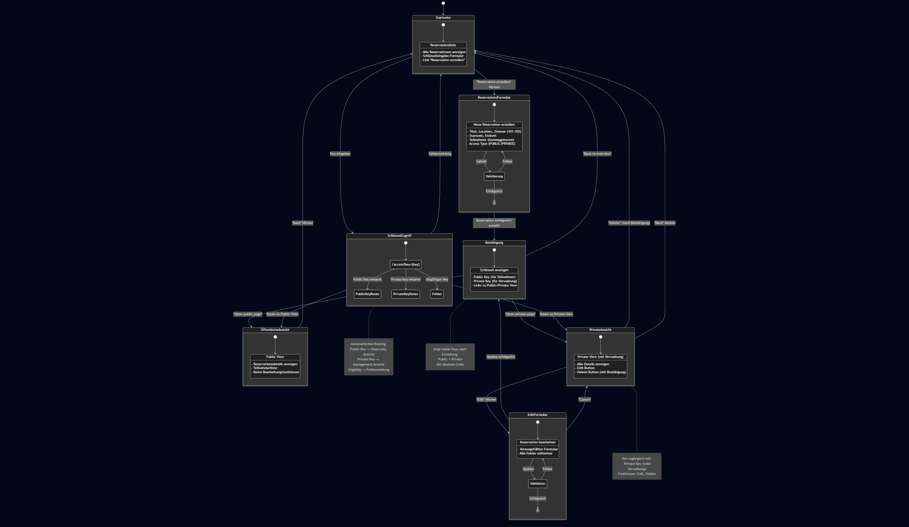
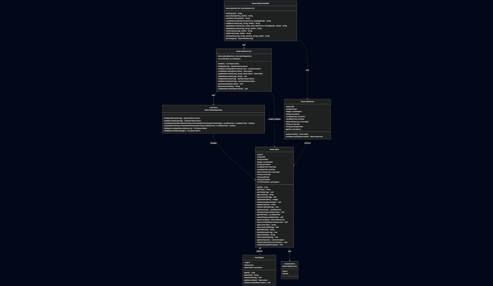

# M223 Terminkalender - Projektdokumentation

**Projekt:** M223 Terminkalender - Reservationssystem für Sitzungs- und Veranstaltungsräume  
**Modul:** M223 – Multiuser-Applikationen objektorientiert realisieren

---

## Inhaltsverzeichnis

1. [Einleitung und Projektauftrag](#1-einleitung-und-projektauftrag)
2. [Anforderungsanalyse](#2-anforderungsanalyse)
3. [UML-Zustandsdiagramm](#3-uml-zustandsdiagramm)
4. [Entity-Relationship-Diagramm (ERD)](#4-entity-relationship-diagramm-erd)
5. [UML-Klassendiagramm](#5-uml-klassendiagramm)
6. [Implementierungsdetails](#6-implementierungsdetails)
7. [Testing und Validation](#7-testing-und-validation)
8. [Build und Deployment](#8-build-und-deployment)
9. [Versionsverwaltung](#9-versionsverwaltung)
10. [Projektteam und Mitwirkende](#10-projektteam-und-mitwirkende)

---

## 1. Einleitung und Projektauftrag

### 1.1 Projektziel

Entwicklung einer Webapplikation zur Verwaltung von Terminreservierungen für die Zimmer 101-105 eines Unternehmens. Die Anwendung ermöglicht es Benutzern ohne Konto, Reservierungen zu erstellen, einzusehen, zu bearbeiten und zu löschen.

### 1.2 Ausgangslage

Das Unternehmen verfügt über mehrere Sitzungs- und Veranstaltungsräume (Zimmer **101–105**). Die Webapplikation soll die Verwaltung von Räumen und Terminen inklusive Reservationen unterstützen.

### 1.3 Hauptfunktionen

- **Reservierung erstellen**: Formular zur Erfassung von Termin, Zimmer, Bemerkungen und Teilnehmern
- **Schlüsselverwaltung**: Zwei Arten von Zugriffsschlüsseln
  - **Public Key**: Lesezugriff für Teilnehmer
  - **Private Key**: Vollzugriff zum Bearbeiten und Löschen
- **Validierung**: Umfassende Eingabevalidierung und Konfliktprüfung
- **Zimmerkonfliktprüfung**: Verhindert doppelte Buchungen desselben Raums

### 1.4 Technologie-Stack

- **Framework**: Spring Boot 3.5.7
- **Java Version**: 17
- **Build Tool**: Maven
- **Datenbank**: MySQL 8.4 (Produktion) / H2 (Tests)
- **Template Engine**: Thymeleaf
- **Persistenz**: Spring Data JPA
- **Validierung**: Jakarta Bean Validation

---

## 2. Anforderungsanalyse

### 2.1 Funktionale Anforderungen

#### Reservationsformular

| Feld | Typ | Format / Vorgaben |
| --- | --- | --- |
| Titel | `String` | Pflichtfeld |
| Standort | `String` | Pflichtfeld |
| Zimmer | `int` | Erlaubte Werte: 101, 102, 103, 104, 105 |
| Startzeit | `LocalDateTime` | Format `yyyy-MM-ddTHH:mm`, muss in der Zukunft liegen |
| Endzeit | `LocalDateTime` | Format `yyyy-MM-ddTHH:mm`, muss nach Startzeit liegen |
| Bemerkung | `String` | 10–200 Zeichen, Pflichtfeld |
| Teilnehmerliste | `String` | Kommagetrennt, nur Buchstaben und Leerzeichen erlaubt |
| Zugangstyp | `Enum` | PUBLIC oder PRIVATE |
| Zugangscode | `String` | Pflicht für PRIVATE Reservierungen |

#### Validierungsregeln

1. **Pflichtfelder**: Kein Feld darf leer bleiben
2. **Zeitvalidierung**:
   - Startzeit muss in der Zukunft liegen
   - Endzeit muss nach Startzeit liegen
3. **Zimmerverwaltung**:
   - Nur Zimmer 101-105 erlaubt
   - Keine überlappenden Reservierungen für dasselbe Zimmer
4. **Bemerkung**: Zwischen 10 und 200 Zeichen
5. **Teilnehmer**: 
   - Mindestens ein Teilnehmer erforderlich
   - Nur Buchstaben (inkl. Umlaute) und Leerzeichen erlaubt
   - Pattern: `^[A-Za-zÄÖÜäöüß\\s]+$`

#### Schlüsselverwaltung

Nach erfolgreicher Reservation werden zwei Schlüssel generiert:

- **Public Key**: 
  - Ermöglicht Read-Only-Zugriff
  - Kann mit Teilnehmern geteilt werden
  - 12 Bytes, Base64-kodiert (URL-sicher, 16 Zeichen)
  
- **Private Key**: 
  - Ermöglicht Bearbeiten und Löschen der Reservation
  - Sollte nur der organisierenden Person bekannt sein
  - 12 Bytes, Base64-kodiert (URL-sicher, 16 Zeichen)
  
Beide Schlüssel werden mit **SecureRandom** kryptographisch sicher generiert.

### 2.2 CRUD-Operationen

| Operation | Endpoint | Autorisierung | Beschreibung |
|-----------|----------|---------------|--------------|
| **Create** | `POST /reservations` | Keine | Neue Reservation erstellen |
| **Read** | `GET /reservations/{id}/public` | Public Key | Reservation einsehen (öffentlich) |
| **Read** | `GET /reservations/{id}/private` | Private Key | Reservation einsehen (privat) |
| **Update** | `POST /reservations/{id}` | Private Key | Reservation bearbeiten |
| **Delete** | `POST /reservations/{id}/delete` | Private Key | Reservation löschen |

---

## 3. UML-Zustandsdiagramm

### Navigation durch die Anwendung

Das Zustandsdiagramm visualisiert die Navigation und Zustandsübergänge in der Webapplikation:



**Hauptzustände:**
- **Index**: Startseite mit Übersicht aller Reservierungen
- **CreateForm**: Formular zum Erstellen einer neuen Reservation
- **EditForm**: Formular zum Bearbeiten einer Reservation (nur mit Private Key)
- **Confirmation**: Bestätigungsseite mit generierten Access Keys
- **KeyAccess**: Zugriffskontrolle über Public/Private Key
- **PublicView**: Öffentliche Ansicht (Read-Only)
- **PrivateView**: Private Ansicht mit Management-Funktionen

**Übergänge:**
1. Von Index zu CreateForm: Benutzer klickt "Create Reservation"
2. Von CreateForm zu Confirmation: Formular erfolgreich validiert und gespeichert
3. Von KeyAccess zu PublicView/PrivateView: Basierend auf eingegebenem Schlüssel
4. Von PrivateView zu EditForm: Bearbeiten-Button (nur mit Private Key)
5. Von PrivateView zu Index: Löschen-Button (nur mit Private Key)

**Entscheidungspunkte:**
- KeyAccess unterscheidet zwischen Public Key (→ PublicView) und Private Key (→ PrivateView)
- PrivateView hat zwei Modi: Mit Private Key (voller Zugriff) oder mit Access Code (nur ansehen)

**Fehlerzustände:**
- Validierungsfehler im CreateForm/EditForm führen zurück zum Formular mit Fehlermeldungen
- Ungültiger Schlüssel in KeyAccess führt zurück zu Index mit Fehlermeldung

---

## 4. Entity-Relationship-Diagramm (ERD)

### Datenbankstruktur

Das ERD zeigt die persistierten Entitäten und ihre Beziehungen:


#### Entität: RESERVATIONS

**Primärschlüssel:** `id` (BIGINT, Auto-Increment)

**Attribute:**
- `title` (VARCHAR, NOT NULL): Titel der Reservation
- `location` (VARCHAR, NOT NULL): Ort der Veranstaltung
- `room_number` (INT, NOT NULL): Zimmernummer (101-105)
- `description` (VARCHAR(1000), NOT NULL): Bemerkung (10-200 Zeichen)
- `start_time` (DATETIME, NOT NULL): Startzeit (muss in Zukunft liegen)
- `end_time` (DATETIME, NOT NULL): Endzeit (muss nach start_time liegen)
- `access_type` (ENUM, NOT NULL): PUBLIC oder PRIVATE
- `access_code` (VARCHAR): Zugangscode (Pflicht bei PRIVATE)
- `public_key` (VARCHAR, UNIQUE, NOT NULL): Öffentlicher Schlüssel
- `private_key` (VARCHAR, UNIQUE, NOT NULL): Privater Schlüssel

**Constraints:**
- `CHECK (room_number BETWEEN 101 AND 105)`
- `CHECK (LENGTH(description) BETWEEN 10 AND 200)`
- `CHECK (end_time > start_time)`
- `UNIQUE (public_key)`
- `UNIQUE (private_key)`

#### Entität: PARTICIPANTS

**Primärschlüssel:** `id` (BIGINT, Auto-Increment)

**Attribute:**
- `name` (VARCHAR, NOT NULL): Name des Teilnehmers (nur Buchstaben)
- `reservation_id` (BIGINT, FK, NOT NULL): Fremdschlüssel zu RESERVATIONS

**Constraints:**
- `FOREIGN KEY (reservation_id) REFERENCES RESERVATIONS(id) ON DELETE CASCADE`
- Name Pattern: Nur Buchstaben (A-Z, a-z, Umlaute) und Leerzeichen

#### Beziehung

**RESERVATIONS ↔ PARTICIPANTS:** 1:N (Eine Reservation hat mehrere Teilnehmer)
- Komposition-Beziehung (Cascade Delete)
- Bi-direktionale Navigation

---

## 5. UML-Klassendiagramm

### Architektur-Übersicht



Die Anwendung folgt einer mehrschichtigen Architektur:

#### Model Layer

**Klasse: Reservation**
- Entity-Klasse mit JPA-Annotationen
- Attribute: id, title, location, roomNumber, description, startTime, endTime, accessType, accessCode, publicKey, privateKey, participants
- Validierungs-Annotationen: @NotBlank, @NotNull, @Min, @Max, @Size, @Future
- Beziehung: @OneToMany zu Participant

**Klasse: Participant**
- Entity-Klasse
- Attribute: id, name, reservation
- Validierung: Name nur Buchstaben
- Beziehung: @ManyToOne zu Reservation

**Enum: ReservationAccess**
- Werte: PUBLIC, PRIVATE

#### Repository Layer

**Interface: ReservationRepository**
- Extends JpaRepository<Reservation, Long>
- Custom Queries:
  - `findByPublicKey(String): Optional<Reservation>`
  - `findByPrivateKey(String): Optional<Reservation>`
  - `existsByRoomNumberAndStartTimeLessThanAndEndTimeGreaterThan(...): boolean`

#### Service Layer

**Klasse: ReservationService**
- Geschäftslogik für CRUD-Operationen
- Key-Generierung mit SecureRandom
- Validierung:
  - Zeitbereich prüfen (Von < Bis, beide in Zukunft)
  - Zimmerkonflikt prüfen
  - Private Key-Autorisierung
- Methoden:
  - `createReservation(Reservation): Reservation`
  - `updateReservation(Long, String, Reservation): Reservation`
  - `deleteReservation(Long, String): void`
  - `findByPublicKey(String): Optional<Reservation>`
  - `findByPrivateKey(String): Optional<Reservation>`
  - `generateSecureKey(): String` (private)

#### Web Layer

**Klasse: ReservationController**
- Spring MVC Controller
- Endpunkte:
  - `GET /`: Index-Seite
  - `GET /access?key=...`: Zugriff per Schlüssel
  - `GET /reservations/new`: Erstellen-Formular
  - `POST /reservations`: Reservation speichern
  - `GET /reservations/{id}/edit?key=...`: Bearbeiten-Formular
  - `POST /reservations/{id}?key=...`: Reservation aktualisieren
  - `POST /reservations/{id}/delete?key=...`: Reservation löschen
  - `GET /reservations/{id}/confirm`: Bestätigungsseite
  - `GET /reservations/{id}/public`: Public View
  - `GET /reservations/{id}/private`: Private View

**Klasse: ReservationForm (DTO)**
- Data Transfer Object für Form-Binding
- Attribute entsprechen Reservation + participantsText (kommasepariert)
- Methoden:
  - `toReservation(): Reservation` - Konvertiert Form zu Entity
  - `fromReservation(Reservation): ReservationForm` - Konvertiert Entity zu Form

---

## 6. Implementierungsdetails

### 6.1 Package-Struktur

```
com.example.reservations
├── model/                  # Entities
│   ├── Reservation.java
│   ├── Participant.java
│   └── ReservationAccess.java
├── repository/             # Data Access
│   └── ReservationRepository.java
├── service/                # Business Logic
│   └── ReservationService.java
├── web/                    # Controllers
│   ├── ReservationController.java
│   └── dto/
│       ├── ReservationForm.java
│       └── ParticipantForm.java
├── config/                 # Configuration
│   └── DataInitializer.java
└── ReservationAppApplication.java
```

### 6.2 Datenbankschema

Die Anwendung nutzt JPA mit `spring.jpa.hibernate.ddl-auto=update` für automatische Schema-Generierung.

**Konfiguration (application.properties):**
```properties
spring.datasource.url=jdbc:mysql://localhost:3306/reservations
spring.datasource.username=reservation_user
spring.datasource.password=change-me
spring.jpa.hibernate.ddl-auto=update
spring.jpa.show-sql=true
```

### 6.3 Seed-Daten

Die Klasse `DataInitializer` lädt 2-3 Beispiel-Reservierungen beim ersten Start:

1. **Team Sync Meeting**
   - Raum 101, PUBLIC
   - Teilnehmer: Alice Johnson, Bob Smith

2. **Client Demo Session**
   - Raum 102, PRIVATE (Code: DEMO2024)
   - Teilnehmer: Carol White, David Brown

3. **Innovation Workshop**
   - Raum 103, PUBLIC
   - Teilnehmer: Eve Black

### 6.4 Sicherheitsfeatures

1. **Kryptographische Schlüsselgenerierung**
   - SecureRandom für Public/Private Keys
   - Base64 URL-safe Encoding
   - 12 Bytes Länge (96 Bit, ergibt 16 Zeichen)

2. **Autorisierung**
   - Edit/Delete: Validierung des Private Keys
   - Keine Möglichkeit, fremde Reservierungen zu ändern

3. **Validierung**
   - Server-seitige Bean Validation
   - Custom Validierung in Service Layer
   - Fehlermeldungen in UI

---

## 7. Testing und Validation

### 7.1 Test-Strategie

**Test-Framework:** JUnit 5 mit Spring Boot Test

**Test-Datenbank:** H2 In-Memory (für isolierte Tests)

### 7.2 Test-Abdeckung

**Status:** ✅ Alle Tests bestanden (19/19)

**Test-Kategorien:**

1. **CRUD Operations**
   - Create Reservation
   - Read Reservation
   - Update Reservation
   - Delete Reservation

2. **Authorization Tests**
   - Valid Private Key
   - Invalid Private Key
   - Access ohne Key

3. **Validation Tests**
   - Zeit-Validierung (Von < Bis, Zukunft)
   - Zimmer-Validierung (101-105)
   - Bemerkung-Länge (10-200 Zeichen)
   - Teilnehmer-Format (nur Buchstaben)

4. **Konfliktprüfung**
   - Überlappende Reservierungen
   - Verfügbare Zeitslots

5. **Key Generation**
   - Uniqueness der Keys
   - Kryptographische Sicherheit

### 7.3 Test-Ausführung

```bash
./mvnw test
```

**Ergebnis:**
```
Tests run: 19, Failures: 0, Errors: 0, Skipped: 0
BUILD SUCCESS
```

---

## 8. Build und Deployment

### 8.1 Voraussetzungen

- Java 17+
- Maven 3.6+
- MySQL 8.0+ oder Docker

### 8.2 Build-Prozess

```bash
# Tests ausführen
./mvnw test

# Package erstellen
./mvnw clean package

# Anwendung starten
./mvnw spring-boot:run
```

### 8.3 Docker Setup

**MySQL Datenbank starten:**
```bash
docker compose up -d
```

**Konfiguration:** Optional `.env` Datei für Credentials (alternativ werden die Standardwerte aus `docker-compose.yml`
verwendet)

### 8.4 Deployment

Die Anwendung läuft auf Port 8080:
```
http://localhost:8080
```

---

## 9. Versionsverwaltung

### 9.1 Git Repository

**URL:** https://github.com/RiciYT/M223-Terminkalender

### 9.2 Branch-Strategie

- `main`: Produktionsstand
- Feature-Branches für Entwicklung

### 9.3 Commit-Historie

Alle Entwicklungsschritte sind im Git-Log nachvollziehbar:
- Initial Setup
- Model Implementation
- Service Layer
- Controller Layer
- Frontend (Thymeleaf)
- Testing
- Documentation


## 10. Projektteam und Mitwirkende

### Projektteam

- Ricardo Santos Lopes (GitHub: RiciYT) — Projektleiter
- Mathias Bäumli — Teampartner
- Imad Chatila — Teampartner

## Anhang A: API-Endpunkte

### Public Endpoints
- `GET /` - Startseite
- `GET /access?key={key}` - Zugriff per Schlüssel
- `GET /reservations/new` - Erstellen-Formular
- `POST /reservations` - Reservation erstellen

### Protected Endpoints (Public Key)
- `GET /reservations/{id}/public` - Public View

### Protected Endpoints (Private Bereich)

- `GET /reservations/{id}/private?authorized=true&key={privateKey}` - Private View (voller Zugriff via Private Key)
- `GET /reservations/{id}/private?code={accessCode}` - Private View (eingeschränkter Zugriff via Zugangscode)
- `GET /reservations/{id}/edit?key={privateKey}` - Edit Form (erfordert Private Key)
- `POST /reservations/{id}?key={privateKey}` - Update (erfordert Private Key)
- `POST /reservations/{id}/delete?key={privateKey}` - Delete (erfordert Private Key)

---

## Anhang B: Verwendete Technologien

| Technologie | Version | Zweck |
|-------------|---------|-------|
| Spring Boot | 3.5.7 | Application Framework |
| Spring Data JPA | 3.5.7 | Persistenz Layer |
| Spring Web MVC | 3.5.7 | Web Layer |
| Thymeleaf | 3.5.7 | Template Engine |
| MySQL Database | 8.4.7 | Production Database (via Docker) |
| MySQL Connector | 9.5.0 | Database Driver |
| Jakarta Validation | 3.5.7 | Bean Validation |
| H2 Database | 2.4.240 | Test Database |
| JUnit 5 | 5.x | Testing Framework |

---

## Fazit

Das M223 Terminkalender Projekt erfüllt alle Anforderungen des Moduls:

✅ **Maven-basiertes Spring Boot Projekt** mit allen erforderlichen Dependencies  
✅ **Vollständige CRUD-Funktionalität** mit Schlüsselverwaltung  
✅ **Umfassende Validierung** (Zeit, Zimmer, Format)  
✅ **Konfliktprüfung** für Zimmerreservierungen  
✅ **UML-Diagramme** (Zustand, Klassen, ERD)  
✅ **Persistente Speicherung** in MySQL  
✅ **Seed-Daten** für Testing  
✅ **Umfassende Tests** (19 Tests, alle bestanden)  
✅ **Vollständige Dokumentation**  

Das Projekt erfüllt die definierten Anforderungen des Projektauftrags.

---

**Ende der Dokumentation**
