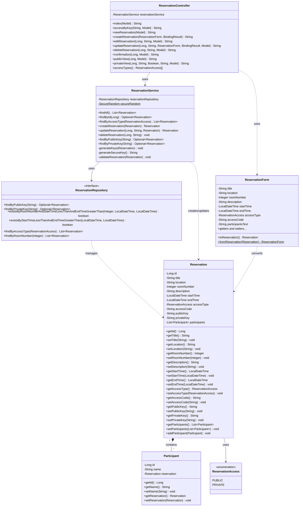

# UML-Klassendiagramm - M223 Terminkalender

## Beschreibung

### Model Layer
- **Reservation**: Hauptentität für Terminreservierungen mit allen Validierungen
- **Participant**: Teilnehmer einer Reservation (Komposition-Beziehung)
- **ReservationAccess**: Enum für Zugangstypen (PUBLIC/PRIVATE)

### Repository Layer
- **ReservationRepository**: JPA Repository für Datenbankzugriff
  - Benutzerdefinierte Queries für Key-Lookup und Konfliktprüfung

### Service Layer
- **ReservationService**: Geschäftslogik
  - CRUD-Operationen (Create, Read, Update, Delete)
  - Key-Generierung (kryptographisch sicher mit SecureRandom)
  - Validierung (Zeitbereich, Raum-Konflikte, Zugangscode)

### Web Layer
- **ReservationController**: Spring MVC Controller
  - HTTP-Endpunkte für alle Operationen
  - Form-Handling und Validierung
  - Navigation und Zugriffskontrolle

### DTO Layer
- **ReservationForm**: Data Transfer Object
  - Formular-Binding für Thymeleaf
  - Conversion zwischen Entity und Form
  - Teilnehmer als kommaseparierter String
