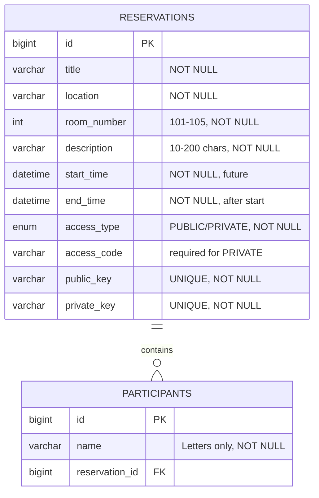

# Entity-Relationship-Diagramm - M223 Terminkalender

## Entitäten

### RESERVATIONS
Die Hauptentität für Terminreservierungen.

**Felder:**
- `id`: Primärschlüssel (Auto-Increment)
- `title`: Titel der Reservation
- `location`: Ort der Reservation
- `room_number`: Zimmernummer (101-105)
- `description`: Bemerkung (10-200 Zeichen Pflicht)
- `start_time`: Startzeit (muss in der Zukunft liegen)
- `end_time`: Endzeit (muss nach Startzeit liegen)
- `access_type`: Zugangstyp (PUBLIC oder PRIVATE)
- `access_code`: Zugangscode (Pflicht bei PRIVATE)
- `public_key`: Öffentlicher Schlüssel für Read-Only-Zugriff (kryptographisch sicher, 12 Bytes Base64, 16 Zeichen)
- `private_key`: Privater Schlüssel für Edit/Delete-Zugriff (kryptographisch sicher, 12 Bytes Base64, 16 Zeichen)

**Constraints:**
- `room_number` zwischen 101 und 105
- `description` zwischen 10 und 200 Zeichen
- `start_time` < `end_time`
- `start_time` in der Zukunft
- Unique Constraint: Keine überlappenden Reservierungen für dasselbe Zimmer

### PARTICIPANTS
Teilnehmer einer Reservation.

**Felder:**
- `id`: Primärschlüssel (Auto-Increment)
- `name`: Name des Teilnehmers (nur Buchstaben und Leerzeichen)
- `reservation_id`: Fremdschlüssel zur Reservation

**Constraints:**
- `name` Pattern: `^[A-Za-zÄÖÜäöüß\\s]+$`
- Cascade Delete: Teilnehmer werden gelöscht, wenn Reservation gelöscht wird

## Beziehungen

- **RESERVATIONS zu PARTICIPANTS**: Eine Reservation hat viele (0..*) Teilnehmer
- Teilnehmer werden als kommaseparierte Liste im Formular eingegeben
