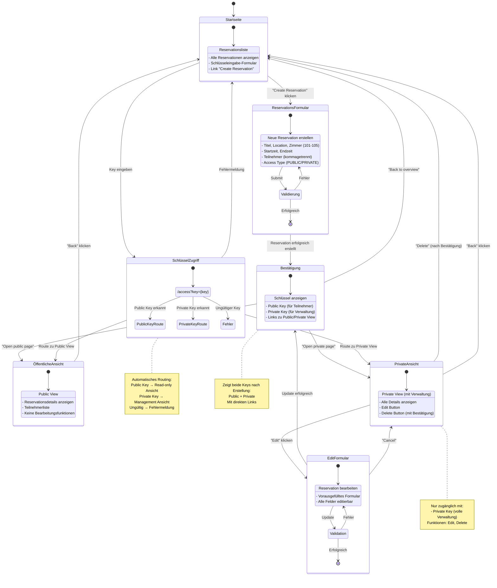

# Zustandsdiagramm Version 2 - M223 Terminkalender Navigation

## Detaillierte Version mit Composite States



## Beschreibung der Zustände

### Hauptzustände:

1. **Startseite** (`/`)
   - Übersicht aller Reservationen in Tabellenform
   - Schlüsseleingabe-Formular für Zugriff
   - Button "Create Reservation"

2. **ReservationsFormular** (`/reservations/new`)
   - Eingabefelder: Titel, Location, Zimmer (101-105), Beschreibung
   - Datum/Zeit: Startzeit und Endzeit (muss in Zukunft liegen)
   - Teilnehmer: Kommagetrennte Liste
   - Access Type: PUBLIC oder PRIVATE
   - Validierung: Client- und Server-seitig

3. **Bestätigung** (`/reservations/{id}/confirm`)
   - Zeigt beide generierten Schlüssel (16 Zeichen, kryptografisch sicher)
   - Public Key: Für Teilnehmer (Read-Only)
   - Private Key: Für Ersteller (Edit/Delete)
   - Direkte Links zu beiden Views

4. **SchlüsselZugriff** (`/access?key={key}`)
   - Automatische Key-Typ-Erkennung
   - Routing basierend auf Key-Typ
   - Fehlerbehandlung bei ungültigen Keys

5. **ÖffentlicheAnsicht** (`/reservations/{id}/public`)
   - Read-Only Ansicht für Teilnehmer
   - Zeigt: Titel, Location, Zimmer, Zeiten, Teilnehmer
   - Keine Bearbeitungsfunktionen

6. **PrivateAnsicht** (`/reservations/{id}/private`)
   - Volle Verwaltungsrechte mit Private Key
   - Edit Button: Öffnet vorausgefülltes Formular
   - Delete Button: Mit Bestätigungsdialog

7. **EditFormular** (`/reservations/{id}/edit`)
   - Vorausgefülltes Formular mit allen aktuellen Werten
   - Alle Felder editierbar (außer Keys)
   - Validierung wie bei Erstellung
   - Private Key erforderlich für Zugriff

## Routing-Logik

```
/access?key={key} Endpoint:
├── Key-Typ prüfen
├── Public Key → redirect zu /reservations/{id}/public
├── Private Key → redirect zu /reservations/{id}/private?authorized=true&key={key}
└── Ungültig → redirect zu / mit Fehlermeldung
```

## Unterschiede zur Original-Version:

✅ **Composite States**: Verschachtelte Zustände mit Unterzuständen  
✅ **Detaillierte Beschreibungen**: Jeder Zustand zeigt seine Funktionen  
✅ **Klarere Übergänge**: Aktionen sind explizit beschriftet  
✅ **Routing-Dokumentation**: Technische Details des /access Endpoints  
✅ **Stil ähnlich zum Referenzbild**: Farbige Bereiche mit strukturierten Inhalten