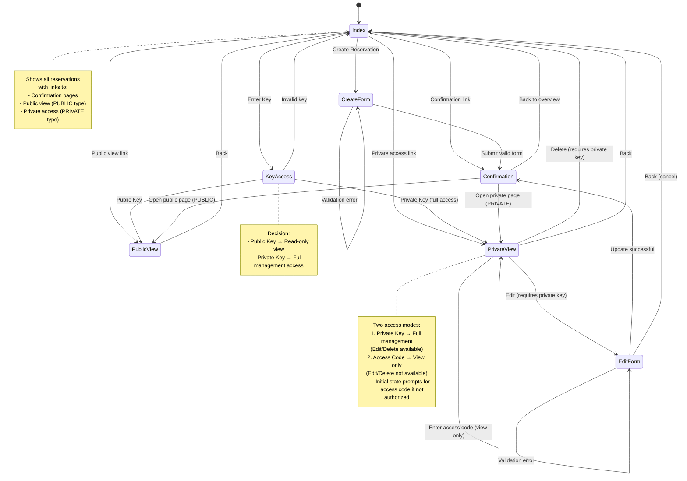

# Zustandsdiagramm - M223 Terminkalender Navigation

## Beschreibung

Dieses Zustandsdiagramm zeigt die Navigation durch die Webapplikation:

- **Index**: Startseite mit Übersicht aller Reservierungen und Links zu Confirmation, Public View und Private Access
- **KeyAccess**: Zugriffskontrolle über Public/Private Key
- **CreateForm**: Formular zum Erstellen einer neuen Reservation
- **EditForm**: Formular zum Bearbeiten einer existierenden Reservation (nur mit Private Key)
- **Confirmation**: Bestätigungsseite nach Erstellen/Aktualisieren mit Access Keys
- **PublicView**: Öffentliche Ansicht einer Reservation (read-only)
- **PrivateView**: Private Ansicht mit zwei Zugriffsmodi:
  - **Mit Private Key**: Vollzugriff mit Edit/Delete-Funktionen
  - **Mit Access Code**: Nur Lesezugriff ohne Verwaltungsfunktionen

## Verbesserungen gegenüber vorheriger Version

1. **Direkte Navigation von Index**: Hinzugefügt von Index zu Confirmation, PublicView und PrivateView (über Links in der Tabelle)
2. **Zwei Zugriffsmodi für PrivateView**: Unterscheidung zwischen Private Key (voller Zugriff) und Access Code (nur ansehen)
3. **Self-Transition in PrivateView**: Zeigt den Zustand, wenn Access Code eingegeben wird
4. **Zurück-Navigation von EditForm**: EditForm kann auch direkt zu Index zurückkehren (Cancel-Aktion)
5. **Erweiterte Notizen**: Klarere Beschreibung der verschiedenen Zugriffsmodi und verfügbaren Links
