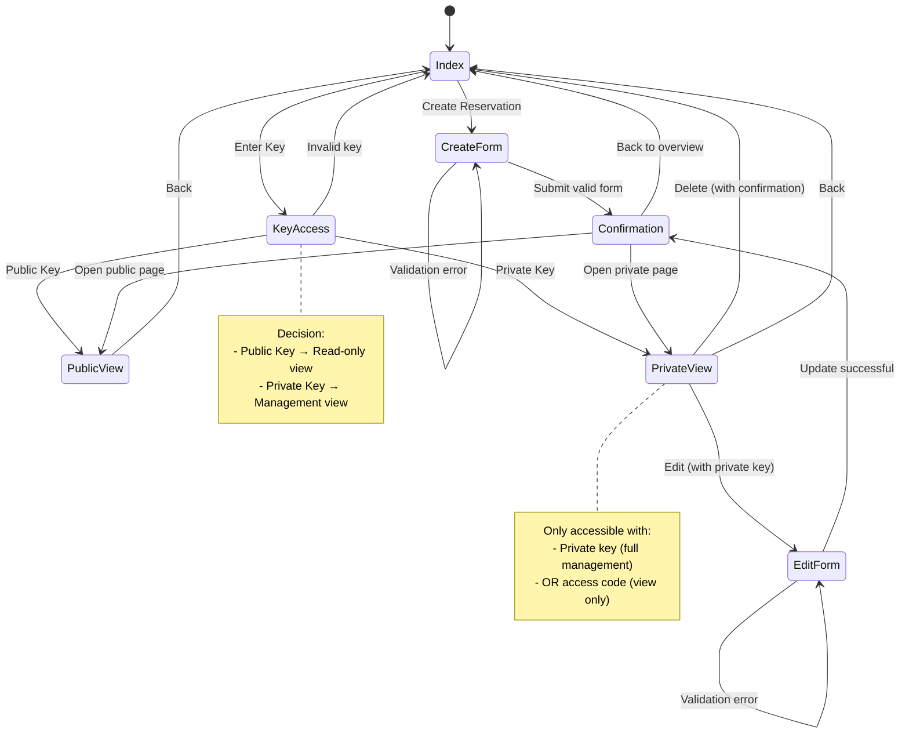

# Zustandsdiagramm - M223 Terminkalender Navigation

## Beschreibung

Dieses Zustandsdiagramm zeigt die Navigation durch die Webapplikation:

- **Index**: Startseite mit Übersicht aller Reservierungen
- **KeyAccess**: Zugriffskontrolle über Public/Private Key
- **CreateForm**: Formular zum Erstellen einer neuen Reservation
- **EditForm**: Formular zum Bearbeiten einer existierenden Reservation (nur mit Private Key)
- **Confirmation**: Bestätigungsseite nach Erstellen/Aktualisieren
- **PublicView**: Öffentliche Ansicht einer Reservation
- **PrivateView**: Private Ansicht mit Verwaltungsfunktionen (Edit/Delete)
